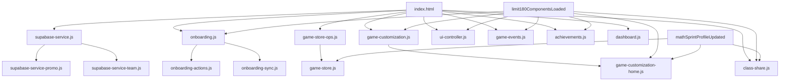

# Limit 180 拆分後模組依賴文件

本文件說明目前拆分後的前端模組依賴關係、載入順序與初始化事件，方便後續維護。

## 1) 載入順序（以 `index.html` 為準）

1. **Supabase 核心與擴充**
   - `js/supabase-service.js`
   - `js/supabase-service-promo.js`
   - `js/supabase-service-team.js`
2. **Onboarding / Storage / Theme / 題庫**
   - `js/onboarding-validator.js`
   - `js/onboarding.js`
   - `js/onboarding-actions.js`
   - `js/onboarding-sync.js`
   - `js/storage*.js`
   - `js/theme-manager.js`
   - `js/generator.js` + `js/missions/*.js`
3. **排行榜 / 載入器 / UI 控制器**
   - `js/leaderboard-renders.js`
   - `js/leaderboard.js`
   - `js/loader.js`
   - `js/ui-controller.js`
4. **遊戲主模組（拆分後）**
   - `js/game-store-assets.js`
   - `js/game-config.js`
   - `js/game-audio.js`
   - `js/game-scaffold.js`
   - `js/game-lobby.js`
   - `js/game-store-ops.js` -> `js/game-store.js`
   - `js/game-store-redeem.js`
   - `js/game-customization.js` -> `js/game-customization-home.js`
   - `js/class-share.js`
   - `js/game-events.js`
   - `js/game-result.js`
   - `js/game-review.js`
   - `js/game-core.js`
   - `js/game-lifecycle.js`
   - `js/game-helper.js`
   - `js/game-play.js`
   - `js/placement-modal.js`
   - `js/game-admin.js` + `js/game-admin-promo.js` + `js/game-admin-team-code.js`

---

## 1.1 圖像化依賴圖（Mermaid）

---

## 2) 核心依賴關係

## 2.1 Supabase 服務層

- `supabase-service.js`
  - 提供 `window.MathSprintSupabaseService` 基礎能力（client/init、成績、全域資產、交易）。
- `supabase-service-promo.js`
  - **依賴** `window.MathSprintSupabaseService.initSupabase`
  - 擴充兌換碼相關方法（upsert/list/redeem）。
- `supabase-service-team.js`
  - **依賴** `window.MathSprintSupabaseService.initSupabase`
  - 擴充分享碼、加入班群、我的團隊資訊方法。

> 規則：擴充檔必須在核心檔之後載入。

## 2.2 Onboarding

- `onboarding.js`
  - 管理 Onboarding UI 狀態與上下文（`MathSprintOnboardingContext`）。
- `onboarding-actions.js`
  - **依賴** `MathSprintOnboardingContext`
  - 處理提交、跨裝置登入、每日登入獎勵、單關同步。
- `onboarding-sync.js`
  - 負責雲端合流與上傳。

> 規則：`onboarding-actions.js` 必須在 `onboarding.js` 之後。

## 2.3 商店與客製化

- `game-store.js`
  - 商店渲染與分頁/稀有度篩選。
  - 購買與賣出透過 `window.GameStoreOps` 代理。
- `game-store-ops.js`
  - **被** `game-store.js` 呼叫，執行實際交易。
- `game-customization.js`
  - 客製化主流程與 `window.AgentCustomization`。
  - 提供 `window.AgentCustomizationHelpers`。
- `game-customization-home.js`
  - **依賴** `window.AgentCustomizationHelpers`
  - 控制首頁身份卡與頭像資訊視窗互動。

> 規則：`game-store-ops.js` 需在 `game-store.js` 之前；`game-customization.js` 需在 `game-customization-home.js` 之前。

## 2.4 團隊分享碼流程

- `class-share.js`
  - **依賴** `MathSprintSupabaseService`（team methods）
  - **依賴** `MathSprintOnboarding.showProfileModal`
  - 功能：建立分享碼、輸入碼加入團隊、顯示「我的團隊資訊」。

---

## 3) 事件依賴（Event Bus）

- `limit180ComponentsLoaded`
  - 幾乎所有模組在此事件中綁定 DOM。
- `mathSprintProfileUpdated`
  - 用於首頁身份卡、商店、團隊資訊同步刷新。
- `limit180AdminAuthorized`
  - 後台模組（兌換碼/團隊碼）在此後載入資料。
- `mathSprintBonusStarAwarded`
  - 遊戲內獎勵提示與延遲結算提示。

---

## 4) 常見改動注意事項

- 新增 Supabase 方法時：
  - 核心能力放 `supabase-service.js`
  - 功能擴充放 `supabase-service-promo.js` / `supabase-service-team.js`
- 若新增首頁身份卡互動：
  - 優先放 `game-customization-home.js`，避免再次膨脹 `game-customization.js`
- 涉及註冊/登入流程：
  - UI 狀態改 `onboarding.js`
  - 提交/同步邏輯改 `onboarding-actions.js`

---

## 5) 快速檢查清單

- `index.html` 的載入順序沒有破壞（特別是擴充模組順序）。
- 單檔行數仍符合 <= 400（JS/CSS/HTML/SQL）。
- `limit180ComponentsLoaded` 與 `mathSprintProfileUpdated` 事件仍有被觸發與監聽。
